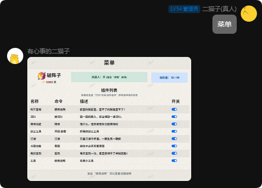

二猫子机器人使用说明

<!-- more -->

## 购买机器人

[点击跳转到淘宝店](https://item.taobao.com/item.htm?ft=t&id=822481210366)

## 开始使用

### 绑定区服

说明：为群绑定一个区服，影响查询功能与推送功能

命令：绑定 区服全称

例如：绑定 破阵子

### 查看菜单

说明：查看本群的一些配置信息。

命令：菜单

插件列表：管理员可以通过命令“打开 xxx”来开启或关闭插件开关，其中xxx为上图中插件名称。
 
### 图标解释：

#### 活跃值

活跃值：与搭话概率成正比，可以自行调节。命令：“活跃值 xx”

该值可以设置为0-99。

 
#### 机器人状态

发送“闭嘴”关闭机器人，发送“说话”打开机器人。

#### 绑定区服

发送命令“绑定 区服全称”来绑定或更改区服。

查询QQ
说明：检查该QQ登录天数以及在贴吧是否有被挂历史。
