## 剑三查询

### 玩家属性

说明：查询玩家战绩及当前装备属性。

命令：战绩/属性 服务器 角色ID

例如：战绩 破阵子 二猫子丨战绩 二猫子

### 全服角色查询

说明：全区服查询角色，包括历史帮会与曾用名

命令：角色 角色ID

例如：角色 晓萌

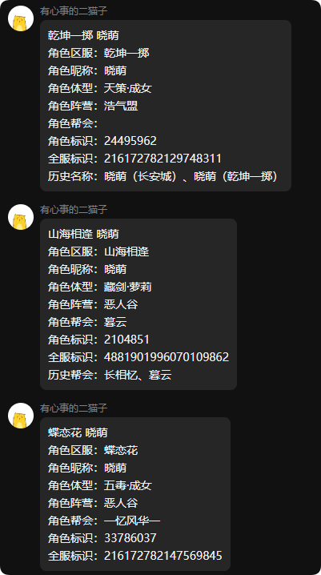

### 角色在线查询

说明：查询角色是否在线

命令：在线 角色ID

例如：在线 二猫子

### 查询角色发言

说明：查询角色在游戏内世界频道的发言记录

命令：聊天 角色ID

例如：聊天 二猫子

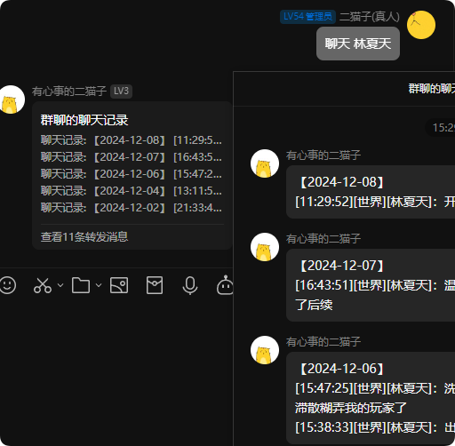

### DPS 计算器

说明：计算某角色的DPS

命令：计算器 角色ID

例如：计算器 二猫子

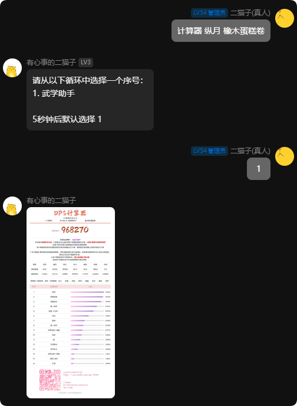

### 资历分布

说明：查询玩家资历各大项分布情况

口令：资历分布 二猫子/资历分布 破阵子 二猫子

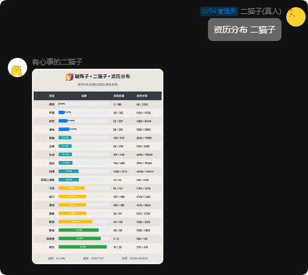

### 资历详细分布

说明：查询玩家资历各个详细分支的分布情况，上方资历分布的类型一列都可以作为参数

口令：资历分布 秘境 二猫子/资历分布 破阵子 秘境 二猫子

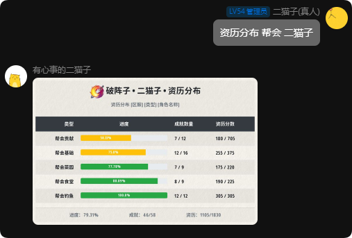

### 关隘首领

说明：查询各个跨服关隘首领的信息。

命令：关隘

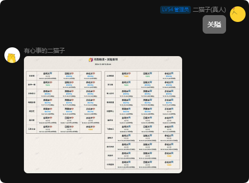

### 马场

说明：查询近期马场刷新信息

命令：马场

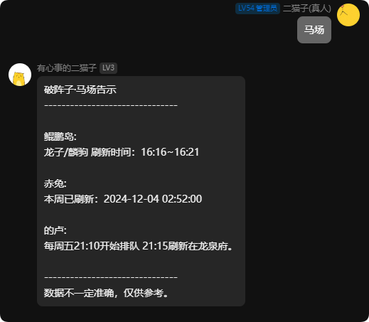

### 战功榜

说明：查询当前服务器战功榜前50帮会

命令：战功榜 丨 战功榜 服务器 丨上周战功榜 丨 赛季战功榜

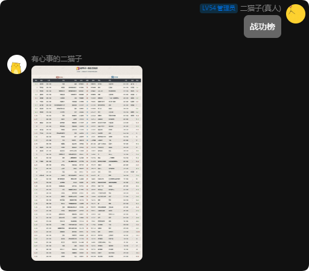

### 招募

说明：查询现时间下服务器的团队招募。

命令：招募 或 招募 + 服务器+关键词

例如：招募 破阵子 河阳之战

如需翻页请输入命令：招募2

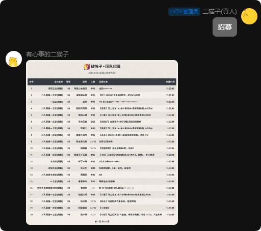

### 交易行

说明：查询当前服务器交易行的物价。

命令：交易行，或交易行 物品名称

例如：交易行 茶饼

### 成本计算器

说明：计算某技艺的成本

命令：成本 物品名称

例如：成本 飞鱼丸

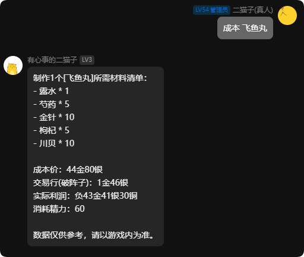

### 副本进度

说明：查询某角色的所有团本进度。

命令：副本 角色名，或 副本 服务器 角色名

例如：副本 破阵子 二猫子

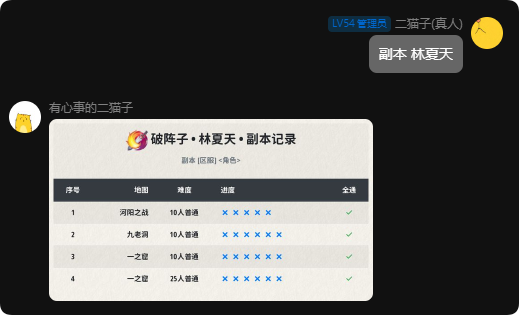

### 日常

说明：查询日常。

命令：日常 | 日常 服务器全称

例如：日常 | 日常 破阵子

另外还有：明天日常、后天日常、大后天日常、大大后天日常、大大大后天日常、大大大大后天日常、大大大大大后天日常……

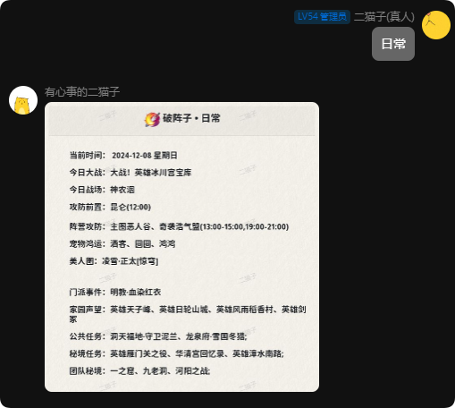

### 日常推演

说明：查询当日前后半个月的日常内容

命令：日常推演

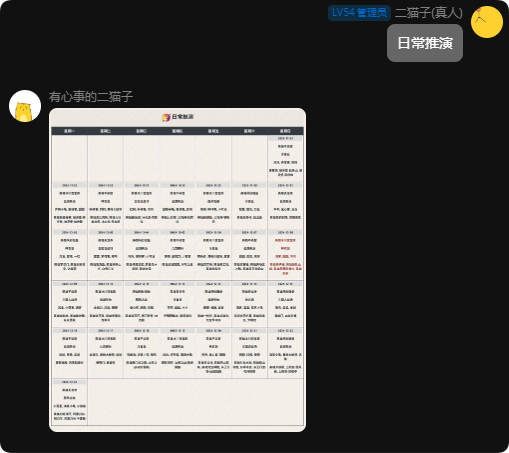

### 本周百战查询

说明：查询本周百战信息。

命令：百战

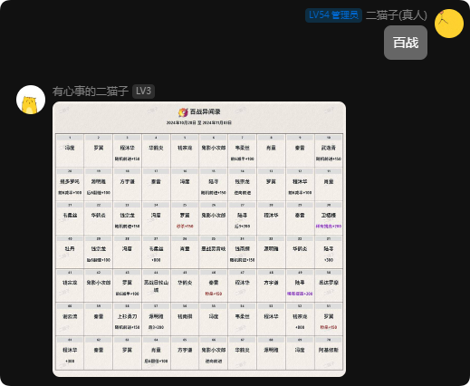

### 角色精耐与百战技能查询

说明：查询角色的精耐与百战技能

命令：百战 角色名

### 战阶排行

说明：查询本周某服务器战阶排行榜前50玩家。

命令：战阶

### 试炼之地

说明：查询试炼之地某门派排行情况

命令：试炼 职业

例如：试炼 藏剑

### 开服

说明：查询服务器的开服状态。

命令：开服 | 开服 服务器全称

例如：开服 | 开服 破阵子

### 沙盘

说明：查询目标服务器沙盘数据

命令：沙盘 | 沙盘 服务器全称

例如：沙盘 | 沙盘 破阵子

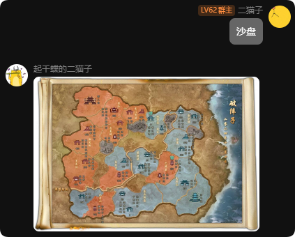

### 金价

说明：查询目标服务器金价数据

命令：金价 | 金价 服务器全称

例如：金价 | 金价 破阵子

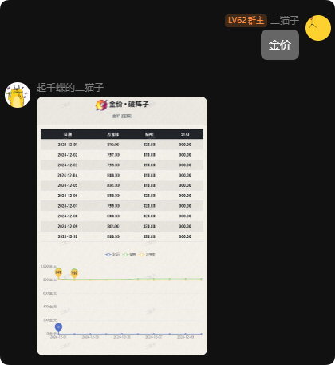

### 小药

说明：查询全职业四小药

命令：小药

### 资历排行

说明：查询目标服务器资历排行名单

命令：资历排行 服务器 职业 

翻页：资历排行2 服务器 职业

例如：资历排行 破阵子 藏剑

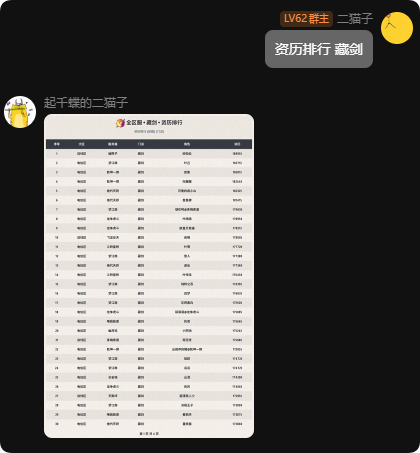

### 蹲宠

说明：查询目标服务器宠物刷新情况

命令：蹲宠 | 蹲宠 服务器全称

例如：蹲宠 | 蹲宠 破阵子

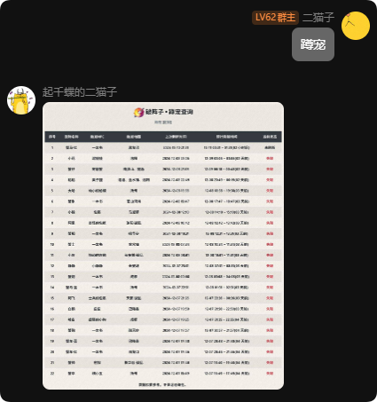

### 汇总

说明：查询目标区服的奇遇汇总

命令：汇总 | 汇总 区服全称

例如：汇总 | 汇总 破阵子

### 前置

说明：查询奇遇的前置

命令：前置 奇遇名

例如：前置 阴阳两界

### 攻略

说明：查询奇遇的攻略

命令：攻略 奇遇名

例如：攻略 阴阳两界

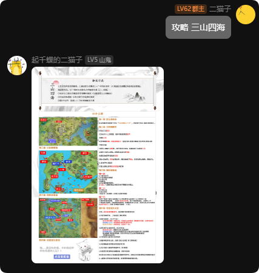

### 奇遇

说明：查询目标区服某奇遇被哪个欧皇触发了

命令：奇遇 奇遇名 | 奇遇 区服全称 奇遇名

例如：奇遇 阴阳两界 | 奇遇 破阵子 阴阳两界

### 个人查询

说明：查询某服务器的某欧皇触发了哪些奇遇

命令：查询 角色名 | 查询 区服全称 角色名

例如：查询 二猫子 | 查询 破阵子 二猫子

如要查询某个等级的奇遇，可输入查询绝世/宠物/全部，进行查询

例如：查询绝世 林夏天

### 烟花

说明：查询某服务器的玩家放烟花与被放烟花的记录

命令：烟花 角色名

例如：烟花 二猫子

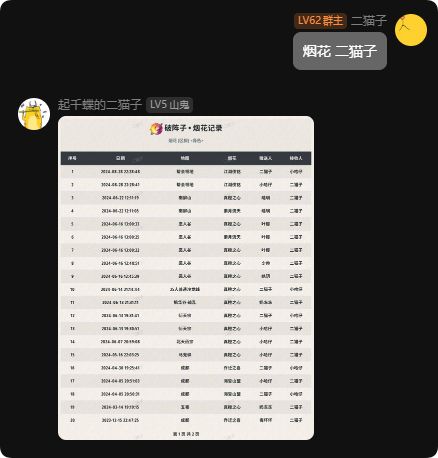

### 物价

说明：查询外观价格

命令：物价 外观名称

例如：物价 猴红

### 骚话

说明：查一句骚话，没啥意思，我想把这个功能砍了

命令：骚话

### 更新公告

说明：查看更新公告

命令：更新公告
