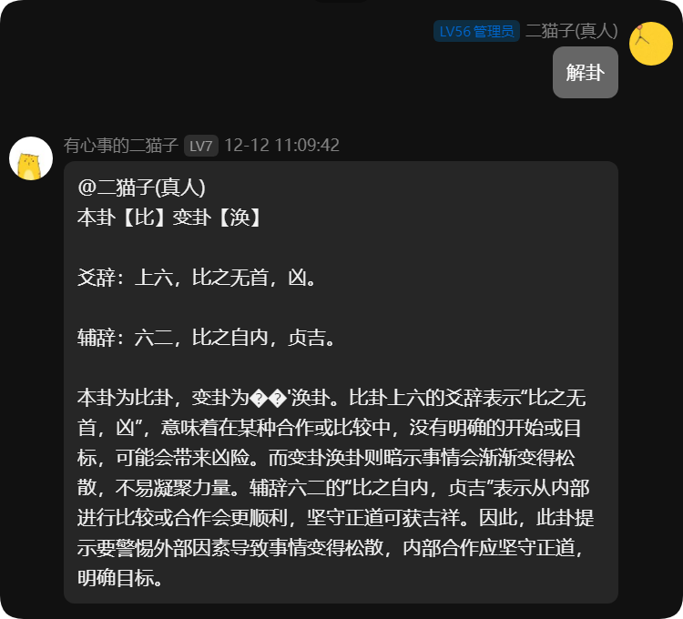

## 签到

说明：每天签到

命令：签到

## 解卦 解释签到时获得的卦象

说明：解释签到时获得的卦象

命令：解卦 | 解卦 [希望咨询的事]

## AI

说明：@机器人 + 你想说的话，智慧的机器人会回复你

命令：@机器人 你想说的话

## 河灯

### 放河灯

说明：放一盏河灯，有概率能被人捡到

命令：放河灯 你想说的话

例如：放河灯 二猫子最帅

### 捡河灯

发送`捞河灯`，它就会帮你捡一盏河灯。

### 回复河灯

捡到的河灯后面都会有一个编号，只要发送命令“回复河灯 编号 回复内容就可以了”

例如：“回复河灯 1970 住口！你这个骗子！”在你放出河灯的同时，被回复的同学也会收到一封电子邮件。

### 我的河灯

说明：查看自己放了哪些河灯，说了哪些骚话。

命令：我的河灯

灰色的是超过了3天的河灯，这些河灯不会被人捡到。

## 避雷

### 添加避雷

说明：在本群内新建避雷名单（只供本群查询）

命令：避雷 名称 备注

例如：避雷 三猫子 比二猫多了一

### 删除避雷

例如：删除避雷 三猫子

## 骰子

说明：随机选择选项或是数字

命令：骰子 甜粽子 咸粽子 | 骰子 1-99

## 吃什么

说明：就是建议你吃什么，但我感觉没有人会听二猫子的建议。

命令：吃什么

## 定时提醒

命令：定时提醒 时间 内容

定时任务有：每天、每周、每月、每年四种形式

如：定时提醒 周六13:00 攻防开始啦！

输入“定时提醒”可查看现有定时提醒内容，输入“删除定时提醒 编号”即可删除。

## 情缘功能

行走江湖，最重要的是什么？当然是情缘了！

命令：分配情缘，组织将为你分配一位情缘。

命令：求情缘@QQ，可向对方邀请绑定情缘。

命令：接受情缘@QQ，可接受对方的邀请，成为情缘！

其他可输入命令 ：情缘，进行查看~
 
## 通知设置：

输入“通知设置”即可打开以下界面：

管理员可通过“打开/关闭 XX”进行操作。如：打开 开服

所有设置需要打开才能正常使用！（蓝色开关为功能成功打开）
 
### 通知设置文案详解

通知设置文案均可自定义（不自定义也行）。

如进群通知，命令为：`通知设置 进群 [@QQ]欢迎欢迎啊喵~`
 
 
 
#### 自定义文案注意事项：

注意，通知内容中，中括号[xx]里的命令为固定形式，可选择添加或不添加，但格式不可更改。

#### 通知条件设置：

#### 奇遇等级设置

奇遇通知打开默认推送绝世奇遇，如需推送普通奇遇，请输入口令：`通知条件设置 奇遇 等级:绝世,普通，即可修改奇遇播报通知。`

修改完成界面：

#### 烟花监听设置

如需监听某人的烟花情况，可设置：`通知条件设置 烟花 接收人:角色ID 发送人:角色ID,角色`ID

修改完成界面：

### 诛恶设置

诛恶通知可设置艾特本人，可设置：通知设置 诛恶 [时间][服务器]的猪在[地图]饿了，快来。@用户 

如需在诛恶开启时艾特全员，需将机器人设为管理员，
并将通知设置改成：通知设置 诛恶 [时间][服务器]的诛恶在[地图]开启了[@all]

注意：[服务器]不要更改成你们的服务器！

修改完成界面：
 

#### 刷马地图设置

如需监听某些地图的刷马情况，可将刷马条件设定为：通知条件设置 刷马 地图:黑龙沼,阴山大草原,黑戈壁 
 

其他通知设置文案不再一一举例，请各位聪明的同学学以致用多多探索~
自定义文案可像下图设置，再不懂请加群咨询~
 
重置通知

如果设置完看累了想返璞归真，可以重置通知：
