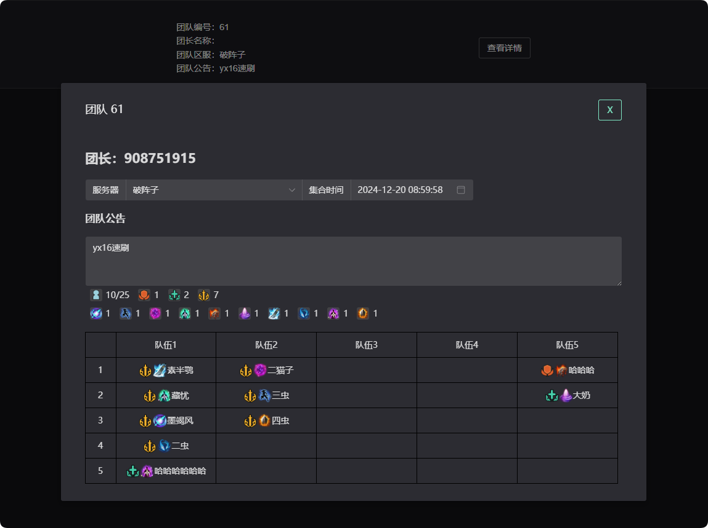

## 前言

所有的团队都可以在团队大厅查看，调整团队在网页上调整更方便。

可以直接拖动调整成员位置，修改团队信息等。右键成员还可以直接修改成员信息。

[https://ermaozi.cn/common/j3team/0](https://ermaozi.cn/common/j3team/0)

可以直接使用自己的QQ邮箱注册账号

## 开团

命令：`开团 集合时间(选填) (服务器(选填)) 成员配置(选填) 团队公告(必填) `

### 快捷开团

简单开团只需`开团 公告内容`即可，例如：`开团 25人英雄一之窟`

### 详细开团

详细开团 如：`开团 5-1 20:00 (念破) [T2 H4 D18] 25人英雄一之窟`

## 开团详细说明

### 集合时间

需要用“`月-日 时:分`”填写，如“`5-1 12:00`”，中间必须有空格。如果开团时标注了时间，那么前30分钟将会在群内@团队所有报名成员，一小时后团队自动解散。

### 服务器

填写时必须用()包裹，如：`(念破)`，如果不填，默认为角色绑定服务器。

### 成员配置

需要用[]包裹，对成员数量进行限制，可以填心法，或是“`输出、治疗、坦克、老板、人数`”，后面跟上限制数字中间空格隔开，例如“`[老板5 坦克2 气纯1 毒经10]`”

其中“`输出、治疗、坦克、老板`”可以用“`D、H、T、B`”来代替。

### 团队公告

将影响团队搜索，建议写清楚团本名称，**团队公告必须放在最后写**。

 
## 报名相关说明

### 报名

命令：`报名 角色名称(选填) 团队序号(选填)`，如果群里只有一个团队则不需要团队编号。如：`报名“或”报名 二猫子 361`

如果没有填写名称则使用**上次报名使用的角色**，若报名角色与游戏一致，则能在团队面板看到装分与血量。

### 代报名

命令：`报名 角色名称 角色心法 团队序号@某人`，如：`报名 二猫子 毒经 361@粗鲁的二猫子`，代报名成功后，集合通知会@此人。

### 团队信息

命令：`团队信息 团队序号(选填)`，可查看你加入的所有团队列表或指定某个团队，如果你没有团队，则查看群内所有团队列表。
 
## 调整开团说明

推荐在网站 [https://ermaozi.cn/common/j3team/0](https://ermaozi.cn/common/j3team/0) 进行修改调整。

### 自动调整团队

`调整团队 团队序号(选填)`，如果群里只有一个团队，则不需要填写序号。

以下调整方法需要坐标辅助，具体坐标算法为：纵坐标第几小队，横坐标第几小队，如二小队第一个人就是`21`，详细请看上图图示。

### 踢人

命令 `调整团队 -坐标`，例如：`调整团队 -12`。

### 标记成员

命令 `调整团队 标记=坐标`，例如：`调整团队 老板=13`标记可选：`老板，治疗，输出，坦克`（**可用简写字母**），标记后团队面板不显示，但是会影响开团时标注的团队限制数量。

### 交换位置

命令 `调整团队 坐标1>坐标2`，例如：`调整团队 11>12`

## 修改开团说明

### 修改公告

命令为：`调整团队 "公告内容"`，公告内容需要用""包裹，例如 ：`调整团队 “25PT武狱黑牢”`

### 修改区服

命令为： `调整团队 (服务器)`，服务器名称需要用()包裹，例如 ：`调整团队 (纵月)`

### 修改团队限制

命令为：`调整团队 [心法或角色n 心法或角色n]`，格式与开团时的一样，必须使用[]包裹，例如 ：`调整团队 [D17 T2 H4 B2]`

### 修改集合时间

命令为：`调整团队 月-日 时:分`，格式与开团时一样，例如：`调整团队 5-1 21:00`

### 合并命令

以上命令可以合并发送，例如：`调整团队 “25PT武狱黑牢” (纵月) [D17 T2 H4 B2] 12-20 21:00`

## 开团管理说明

### 关闭报名

命令：`调整团队 !关`

关闭报名后团队无法被搜索也无法加入

### 开启报名

命令：`调整团队 !开`

启报名后团队可以被搜索，也可以加入。开团时默认为开启状态。

### 私有团队

命令：`调整团队 !私有`

团队转为私有之后仅允许群员搜索与报名。

### 公开团队

命令：`调整团队 !公开`

团队转为公开团队后，所有人都可以搜索与报名，开团时默认为公开团队

### 转让团长

命令：`调整团队 !转让坐标`，转让队长给团队里的某个人，例子：`调整团队 !转让22`

转让时需要再发送确认转让进行确认

### 解散团队

命令：`调整团队 !解散`

解散团队时需要进行确认操作

### 退出团队

命令：`退出团队 团队序号`

### 搜索团队

命令：`搜索团队 服务器(选填)  搜索内容(选填)` 

所有公开团队的团队的团队公告进行搜索，支持正则，默认为搜索全部。
 
## 开团个人操作

### 新建角色

命令：`角色管理 角色名称 心法 服务器(选填)`。

### 查看角色

命令：`角色管理，可查看自己创建的所有角色`。

### 删除角色

命令：`角色管理 -角色名称`。
