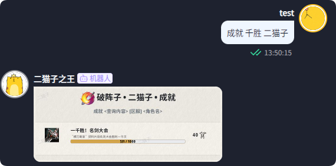
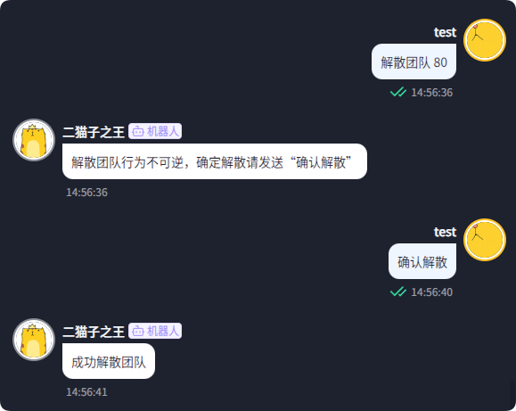
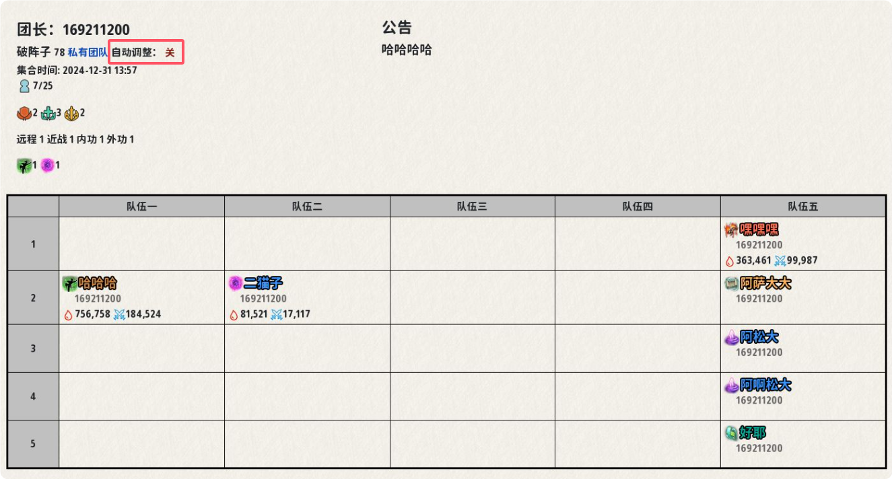
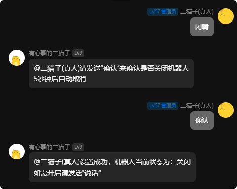
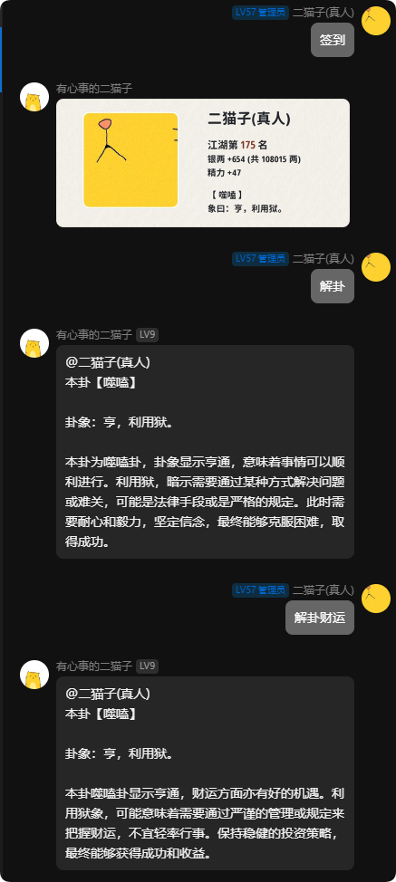

## 2024-12-26

### 增加了成就查询

命令: `成就 查询内容 角色名`

## 2024-12-25

### 增加了阵眼查询

命令: `阵眼 心法`

## 2024-12-24

### 1. 优化了开团与报名失败的提示信息

减少歧义，提升新用户报团体验。

### 2. 确认解散团队时不需要输入团队编号了

发送“解散团队”后直接输入“确认解散”即可

### 3. 增加了自动调整团队

自动调整团队可以根据成员心法来自动安排该成员在团队中的位置

开团时默认开启自动调整团队，可以通过`关闭自动调整`进行关闭

当手动调整团队时，自动调整团队会被关闭，可以通过`开启自动调整`进行开启

## 2024-12-17

### 优化通知推送

增加推送重试次数、识别异常群聊，大大降低通知推送失败概率

## 2024-12-14

### 1. 增加功能: 找师父/找徒弟

命令: `找师父` 或 `找徒弟`

### 2. 增加功能: 阵营拍卖

命令: `阵营拍卖`

### 3. 关闭机器人时需要二次确认

防止误触导致关闭机器人

## 2024-12-13

### 取消了团队报名中“默认角色”的相关机制

现在任何操作都不再需要选择默认角色。当报名、退团等操作需要默认角色时，会自动选择上次报名所使用的角色。

## 2024-12-12

### 优化了解卦玩法

现在的解卦功能可以更直白的解释卦象，同时可以指定解卦内容

